# PyTorch Learning Rate Schedulers Summaries

PyTorchの`torch.optim.lr_scheduler`モジュールに含まれる主要なスケジューラの一覧。
詳細なパラメータ等は表の下にまとめています。

## 比較一覧表

| 名称 / Docs | 説明 | 主要パラメータ (変更できる要素) | グラフ (Base Parameter) |
| :--- | :--- | :--- | :--- |
| [**StepLR**](#steplr) ([Docs](https://docs.pytorch.org/docs/stable/generated/torch.optim.lr_scheduler.StepLR.html)) | 指定周期ごとに一定割合で減衰 | `step_size` (周期), `gamma` (減衰率) | 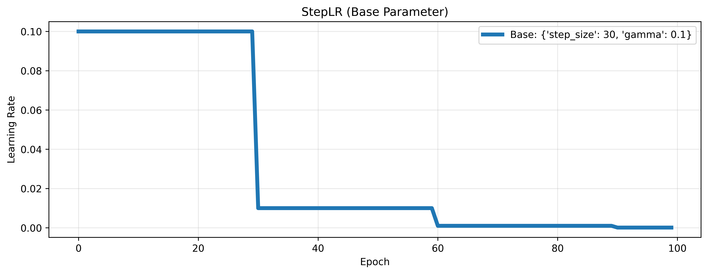 |
| [**MultiStepLR**](#multisteplr) ([Docs](https://docs.pytorch.org/docs/stable/generated/torch.optim.lr_scheduler.MultiStepLR.html)) | 指定ステップで減衰 | `milestones` (減衰タイミングのリスト), `gamma` (減衰率) | 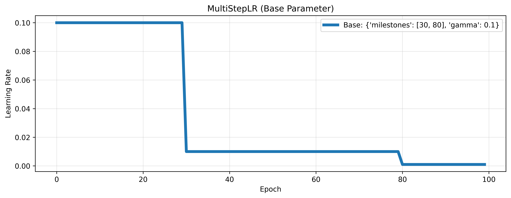 |
| [**ConstantLR**](#constantlr) ([Docs](https://docs.pytorch.org/docs/stable/generated/torch.optim.lr_scheduler.ConstantLR.html)) | (Warmup用) 初期に定数倍下げ、その後戻す | `factor` (倍率), `total_iters` (期間) | 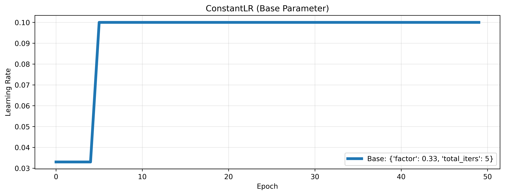 |
| [**LinearLR**](#linearlr) ([Docs](https://docs.pytorch.org/docs/stable/generated/torch.optim.lr_scheduler.LinearLR.html)) | (Warmup用) 初期に線形変化させ、その後戻す | `start_factor`, `end_factor` (倍率), `total_iters` (期間) | 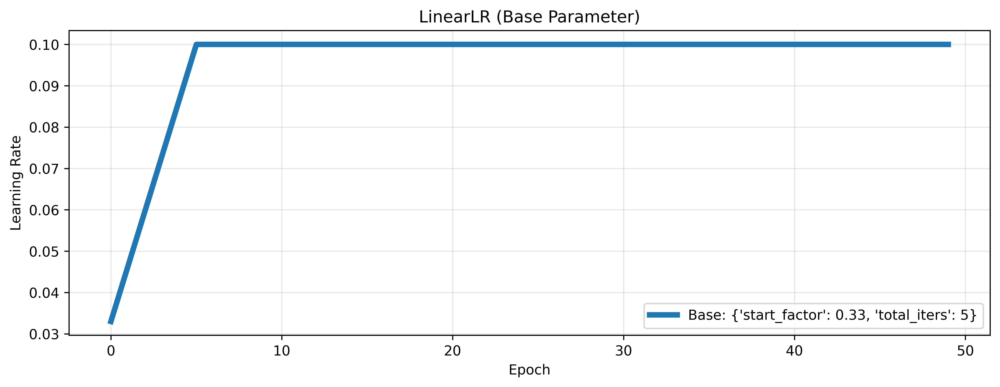 |
| [**ExponentialLR**](#exponentiallr) ([Docs](https://docs.pytorch.org/docs/stable/generated/torch.optim.lr_scheduler.ExponentialLR.html)) | 指数関数的に減衰 | `gamma` (毎エポックの減衰率) | 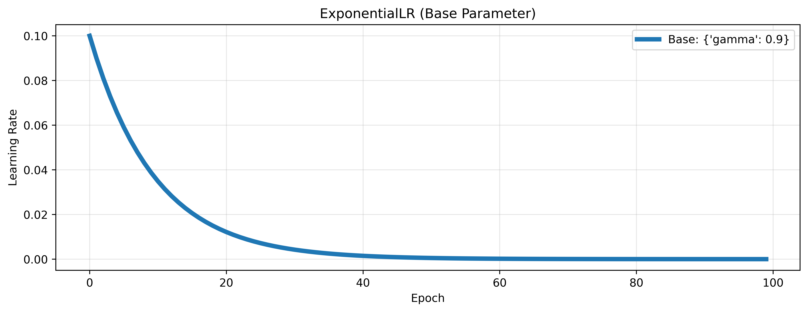 |
| [**PolynomialLR**](#polynomiallr) ([Docs](https://docs.pytorch.org/docs/stable/generated/torch.optim.lr_scheduler.PolynomialLR.html)) | 多項式関数に従って減衰 | `total_iters` (終了ステップ), `power` (次数) |  |
| [**CosineAnnealingLR**](#cosineannealinglr) ([Docs](https://docs.pytorch.org/docs/stable/generated/torch.optim.lr_scheduler.CosineAnnealingLR.html)) | コサインカーブで減衰 | `T_max` (半周期), `eta_min` (最小LR) | 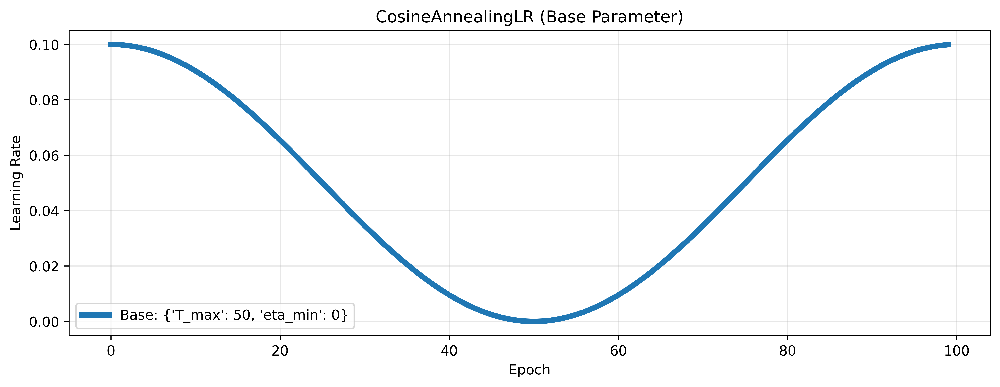 |
| [**ReduceLROnPlateau**](#reducelronplateau) ([Docs](https://docs.pytorch.org/docs/stable/generated/torch.optim.lr_scheduler.ReduceLROnPlateau.html)) | 指標停滞時に減衰 | `factor` (減衰率), `patience` (待機期間), `threshold` (閾値) | 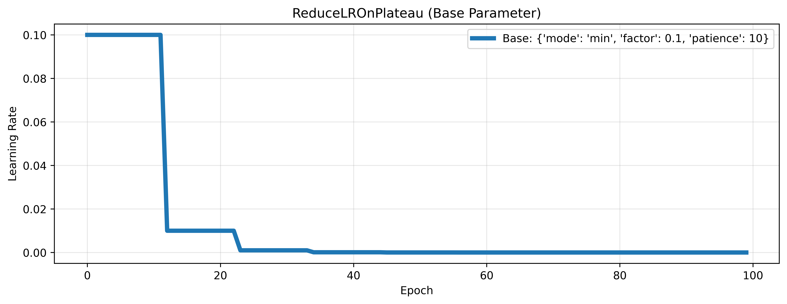 |
| [**CyclicLR**](#cycliclr) ([Docs](https://docs.pytorch.org/docs/stable/generated/torch.optim.lr_scheduler.CyclicLR.html)) | 範囲内で周期的に変動 | `base_lr`, `max_lr` (範囲), `step_size_up` (上昇幅), `mode` (形状) | 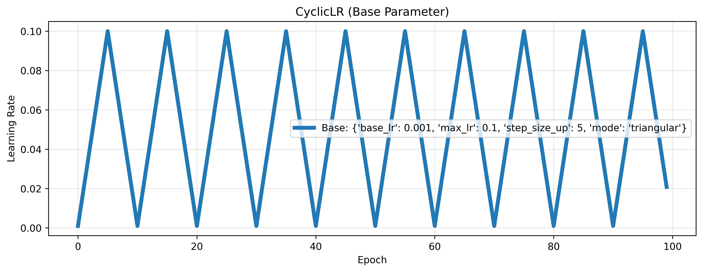 |
| [**OneCycleLR**](#onecyclelr) ([Docs](https://docs.pytorch.org/docs/stable/generated/torch.optim.lr_scheduler.OneCycleLR.html)) | 1サイクルで上昇・下降 | `max_lr` (最大値), `total_steps` (総ステップ), `pct_start` (上昇割合) | 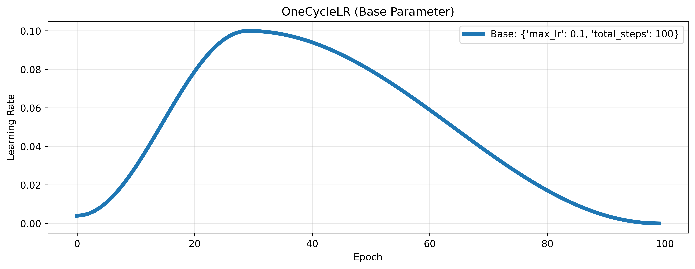 |
| [**CosineAnnealingWarmRestarts**](#cosineannealingwarmrestarts) ([Docs](https://docs.pytorch.org/docs/stable/generated/torch.optim.lr_scheduler.CosineAnnealingWarmRestarts.html)) | 周期的にリスタート | `T_0` (初期周期), `T_mult` (周期倍率), `eta_min` (最小LR) | 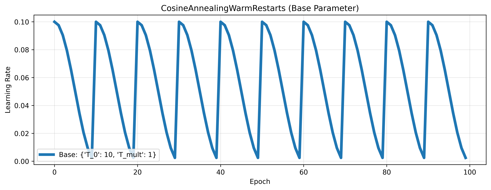 |

---

## 詳細データ

### StepLR
[Official Docs](https://docs.pytorch.org/docs/stable/generated/torch.optim.lr_scheduler.StepLR.html)

**パラメータ**:
- `step_size` (int): 学習率を減衰させる周期（エポック数）。
- `gamma` (float): 減衰率。デフォルトは0.1。
- `last_epoch` (int): 最後の更新エポックのインデックス。再開時に使用。デフォルトは-1。
- `verbose` (bool): 更新ごとにメッセージを出力するかどうか。

**Parameter Variation:**
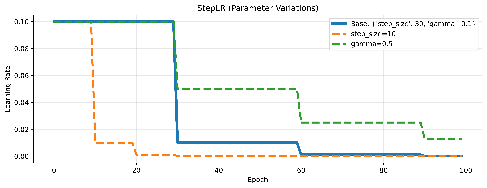

---

### MultiStepLR
[Official Docs](https://docs.pytorch.org/docs/stable/generated/torch.optim.lr_scheduler.MultiStepLR.html)

**パラメータ**:
- `milestones` (list): 学習率を減衰させるエポック数のリスト。
- `gamma` (float): 減衰率。デフォルトは0.1。
- `last_epoch` (int): 最後の更新エポックのインデックス。

**Parameter Variation:**
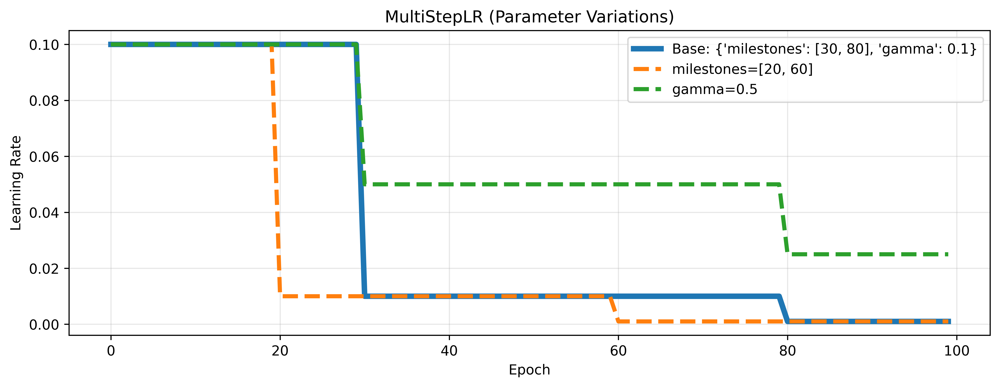

---

### ConstantLR
[Official Docs](https://docs.pytorch.org/docs/stable/generated/torch.optim.lr_scheduler.ConstantLR.html)

**概要**:
学習の初期段階（ウォームアップ）などで使用されます。`total_iters` の間は学習率を `factor` 倍（通常は1より小さい値）に下げ、その後元の学習率に戻します。そのため、グラフ上は低い値からステップ後に元の値へ**増加**するように見えます。

**パラメータ**:
- `factor` (float): 学習率に掛ける定数。デフォルトは1.0/3。
- `total_iters` (int): 定数を掛ける期間（ステップ数/エポック数）。
- `last_epoch` (int): 最後の更新エポックのインデックス。

**Parameter Variation:**
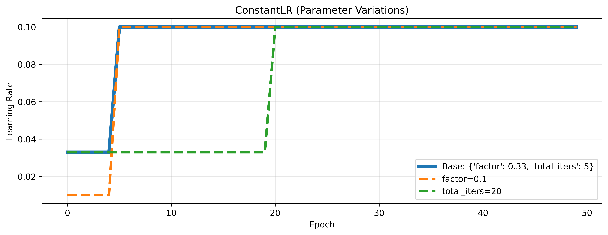

---

### LinearLR
[Official Docs](https://docs.pytorch.org/docs/stable/generated/torch.optim.lr_scheduler.LinearLR.html)

**概要**:
こちらもウォームアップによく使用されます。`total_iters` の間、`start_factor` から `end_factor` (デフォルト1.0) に向かって学習率を線形に変化させます。デフォルト設定では低い値から元の値へ**増加**します。

**パラメータ**:
- `start_factor` (float): 開始時の学習率の倍率。デフォルトは1.0/3。
- `end_factor` (float): 終了時の学習率の倍率。デフォルトは1.0。
- `total_iters` (int): 線形変化させる期間。
- `last_epoch` (int): 最後の更新エポックのインデックス。

**Parameter Variation:**
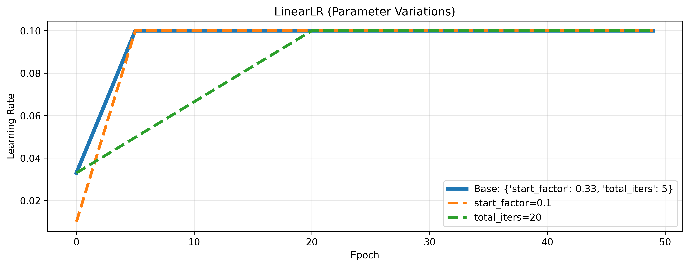

---

### ExponentialLR
[Official Docs](https://docs.pytorch.org/docs/stable/generated/torch.optim.lr_scheduler.ExponentialLR.html)

**パラメータ**:
- `gamma` (float): 毎エポックの減衰率。
- `last_epoch` (int): 最後の更新エポックのインデックス。

**Parameter Variation:**
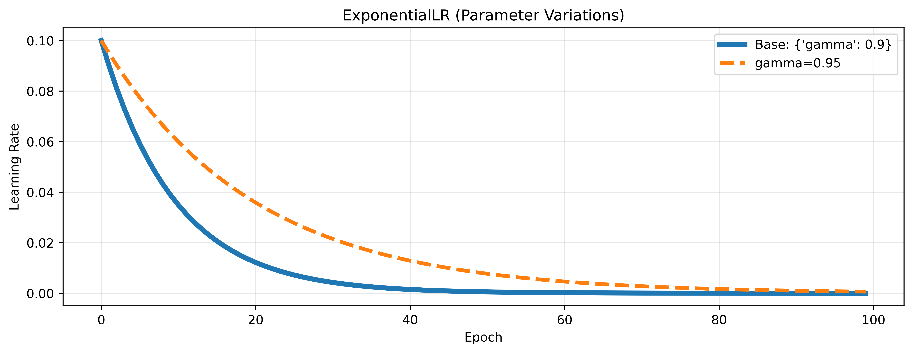

---

### PolynomialLR
[Official Docs](https://docs.pytorch.org/docs/stable/generated/torch.optim.lr_scheduler.PolynomialLR.html)

**パラメータ**:
- `total_iters` (int): 減衰を完了するステップ数。
- `power` (float): 多項式の次数。1.0で線形減衰。
- `last_epoch` (int): 最後の更新エポックのインデックス。

**Parameter Variation:**
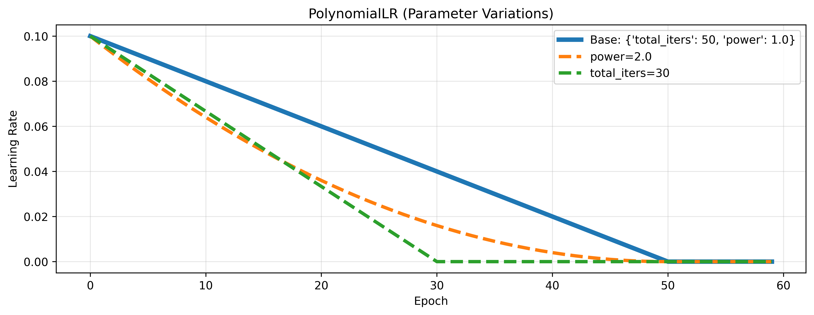

---

### CosineAnnealingLR
[Official Docs](https://docs.pytorch.org/docs/stable/generated/torch.optim.lr_scheduler.CosineAnnealingLR.html)

**パラメータ**:
- `T_max` (int): 半周期のステップ数。
- `eta_min` (float): 学習率の最小値。デフォルトは0。
- `last_epoch` (int): 最後の更新エポックのインデックス。

**Parameter Variation:**
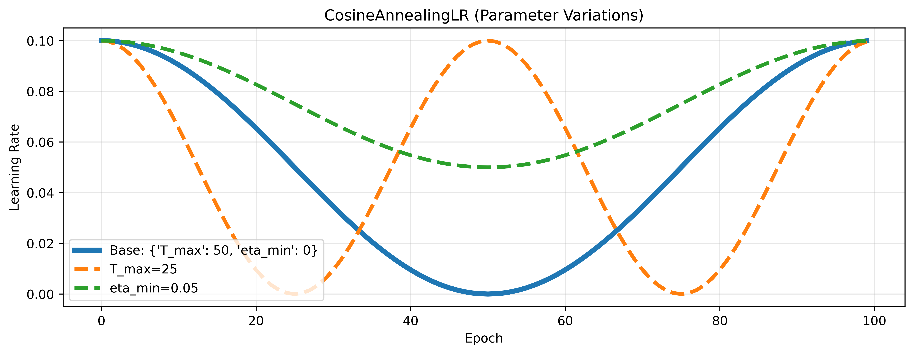

---

### ReduceLROnPlateau
[Official Docs](https://docs.pytorch.org/docs/stable/generated/torch.optim.lr_scheduler.ReduceLROnPlateau.html)

**パラメータ**:
- `mode` (str): 'min'（最小化）か'max'（最大化）か。
- `factor` (float): 学習率を下げる割合。new_lr = lr * factor。
- `patience` (int): 改善が見られないエポック数を何回許容するか。
- `threshold` (float): 改善とみなすための閾値。
- `threshold_mode` (str): 閾値の判定方法。
- `cooldown` (int): 学習率を下げた後、監視を再開するまでの待機期間。
- `min_lr` (float or list): 学習率の下限。
- `eps` (float): 学習率の更新幅の最小値。

**Parameter Variation:**

---

### CyclicLR
[Official Docs](https://docs.pytorch.org/docs/stable/generated/torch.optim.lr_scheduler.CyclicLR.html)

**パラメータ**:
- `base_lr` (float or list): 学習率の（サイクルの）下限。
- `max_lr` (float or list): 学習率の（サイクルの）上限。
- `step_size_up` (int): 学習率が上昇しきるまでのステップ数。
- `step_size_down` (int): 学習率が下降しきるまでのステップ数。
- `mode` (str): 'triangular', 'triangular2', 'exp_range'のいずれか。
- `gamma` (float): 'exp_range'時のスケーリング係数。
- `scale_fn` (function): カスタムスケーリング関数。
- `scale_mode` (str): 'cycle' or 'iterations'.
- `cycle_momentum` (bool): momentumも逆に変動させるかどうか。

**Parameter Variation:**
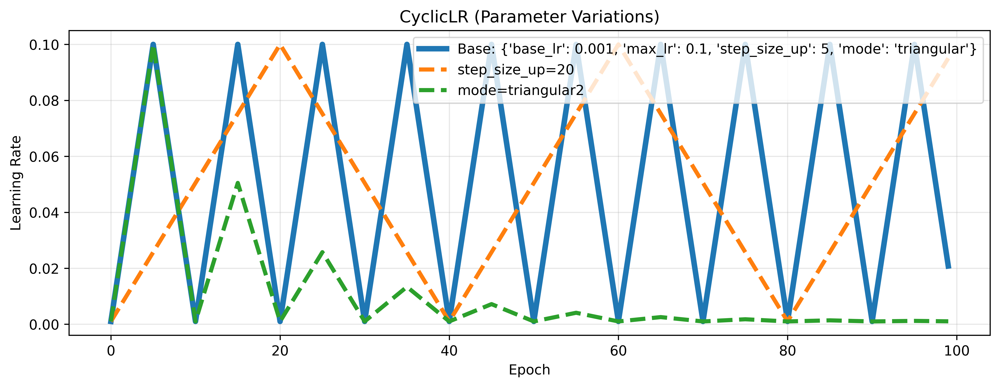

---

### OneCycleLR
[Official Docs](https://docs.pytorch.org/docs/stable/generated/torch.optim.lr_scheduler.OneCycleLR.html)

**パラメータ**:
- `max_lr` (float or list): 学習率の最大値。
- `total_steps` (int): サイクル全体の総ステップ数。
- `epochs` (int): エポック数（total_stepsを指定しない場合に使用）。
- `steps_per_epoch` (int): 1エポックあたりのステップ数。
- `pct_start` (float): 学習率が上昇する期間の割合。
- `anneal_strategy` (str): 'cos' (コサイン) か 'linear' (線形)。
- `cycle_momentum` (bool): momentumも変動させるかどうか。
- `div_factor` (float): 初期学習率を決定する係数 (initial_lr = max_lr/div_factor)。
- `final_div_factor` (float): 最終学習率を決定する係数 (final_lr = initial_lr/final_div_factor)。

**Parameter Variation:**
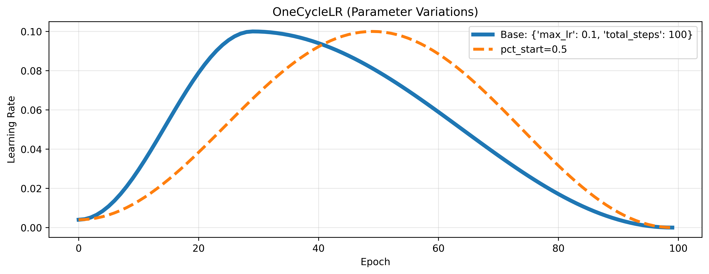

---

### CosineAnnealingWarmRestarts
[Official Docs](https://docs.pytorch.org/docs/stable/generated/torch.optim.lr_scheduler.CosineAnnealingWarmRestarts.html)

**パラメータ**:
- `T_0` (int): 初回のリスタートまでのステップ数。
- `T_mult` (int): リスタートごとに周期を何倍にするか。1なら等間隔。
- `eta_min` (float): 学習率の最小値。
- `last_epoch` (int): 最後の更新エポックのインデックス。

**Parameter Variation:**
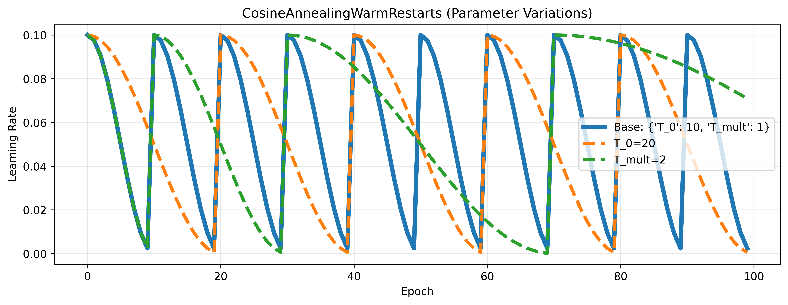
